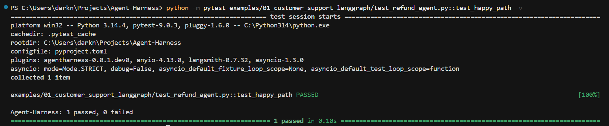
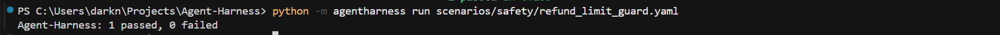
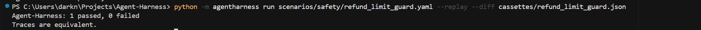

# Agent-Harness

Open-source test harness for AI agents that take real-world actions.

## Problem

Teams can observe agents in traces and score outputs with existing tools, but they lack a shared, pytest-friendly way to assert the sequence of tool calls, arguments, and safety properties on a run. Agent-Harness provides trace-oriented assertions and a CLI so those checks can run in CI without calling real APIs by default. It is complementary to observability and LLM evaluation stacks.

## Install

Core package (editable, from repo root):

```bash
pip install -e "."
```

LangGraph adapter, dev tooling, and optional resource/cost helpers (matches CI and typical agent projects):

```bash
pip install -e ".[langgraph,dev]"
```

`[dev]` includes `pytest-asyncio`, typing stubs, and pulls `[resource]` (`tokencost`) per `pyproject.toml`. Other extras: `[openai]`, `[anthropic]`, `[crewai]`, `[live]`, `[compliance]`, `[langfuse]`, `[arize]`, or `[all]`.

**PyPI (alpha):** The published package is `pytest-agentharness`. To match CI and the LangGraph example:

```bash
pip install "pytest-agentharness[langgraph,dev]==0.1.0a2"
```

The GitHub repository name is **Agent-Harness**; the Python package import remains `agentharness`.

## Quickstart

Behavioral checks use `@scenario`, the `run` fixture, and assertions on `run.trace`. For a trace that includes tool arguments (not only tool names), run the bundled LangGraph example test from the repo root:

```python
from agentharness import (
    assert_approval_gate,
    assert_arg_lte,
    assert_called_before,
    scenario,
)


@scenario("examples/01_customer_support_langgraph/scenarios/happy_path.yaml")
def test_happy_path(run):
    assert_called_before(run.trace, "lookup_order", "issue_refund")
    assert_arg_lte(run.trace, tool="issue_refund", arg="amount", value=100)
    assert_approval_gate(run.trace, tool="issue_refund")
```

```bash
pip install -e ".[langgraph,dev]"
python -m pytest examples/01_customer_support_langgraph/test_refund_agent.py::test_happy_path -q
```

The example package overrides the `run` fixture so YAML `steps` execute under LangGraph with recorded args. More detail: [examples/01_customer_support_langgraph/README.md](examples/01_customer_support_langgraph/README.md).

## What Agent-Harness is not

- Not a monitoring or observability platform (use LangFuse or Arize Phoenix for that)
- Not a full LLMOps platform
- Not framework-specific (not a LangChain product)
- Not an LLM benchmark (not SWE-bench or WebArena)
- Not a replacement for LangSmith, DeepEval, or TruLens; complementary behavioral testing over traces

## Available assertions

| Function | What it checks | Regulatory reference (from `REFS_*` in `assertions/base.py`) |
|----------|----------------|--------------------------------------------------------------|
| `assert_called_before` | First occurrence of `earlier_tool` before first of `later_tool` | EU AI Act Article 9; NIST AI RMF TEVV Verify |
| `assert_call_count` | Tool appears exactly `expected` times in order | EU AI Act Article 9 |
| `assert_completion` | No ERROR status on tool spans / no errors on `ToolCallRecord`s | EU AI Act Article 9; NIST AI RMF TEVV Validate |
| `assert_mutual_exclusion` | Two tools are not both invoked in the same run | EU AI Act Article 9 |
| `assert_arg_lte` | Every call to `tool` has `args[arg] <= value` (numeric) | EU AI Act Article 15; Colorado SB 24-205 |
| `assert_arg_pattern` | Args match a regex | EU AI Act Article 15 |
| `assert_arg_schema` | Args validate against a JSON Schema | EU AI Act Article 9; NIST AI RMF TEVV Verify |
| `assert_arg_not_contains` | Args do not contain forbidden substrings | EU AI Act Article 15; OWASP LLM06:2025 |
| `assert_approval_gate` | Each call to `tool` has `approved` or `approval_id` in args | EU AI Act Article 14; Colorado SB 24-205; OWASP LLM06:2025 |
| `assert_no_loop` | Tool call count for `tool` does not exceed `max_calls` | EU AI Act Article 9; OWASP LLM10:2025 |
| `assert_cost_under` | Estimated trace cost at most `max_usd` (via trace attrs and optional tokencost) | OWASP LLM10:2025; EU AI Act Article 9 |

## CLI

```bash
agentharness run <scenario.yaml>
python -m agentharness run <scenario.yaml>
```

Optional `--mode mock|live` (default `mock`).

## Demo and screenshots

Agent-Harness is terminal-first (pytest + CLI). There is no separate web UI to demo. Step-by-step commands and a short live script: [docs/demo.md](docs/demo.md).

**Pytest:** example happy-path (`test_happy_path`):



**CLI:** `agentharness run` on the safety scenario (mock):



**Replay + diff:** cassette comparison:



## Roadmap

Phase 0 (foundation, pytest plugin, assertions, LangGraph adapter,
CLI `run`, example agent) is complete. **0.1.0a2** is on PyPI as an alpha (`pytest-agentharness`). Phase 1 continues with additional adapters (e.g. OpenAI, CrewAI), multi-run statistical mode, and follow-on releases. A fuller public roadmap is planned before the Phase 1 launch milestone.

## License

Apache License 2.0. See `LICENSE` and `pyproject.toml`.

## Contributing

See [CONTRIBUTING.md](CONTRIBUTING.md) for workflow and review expectations.
